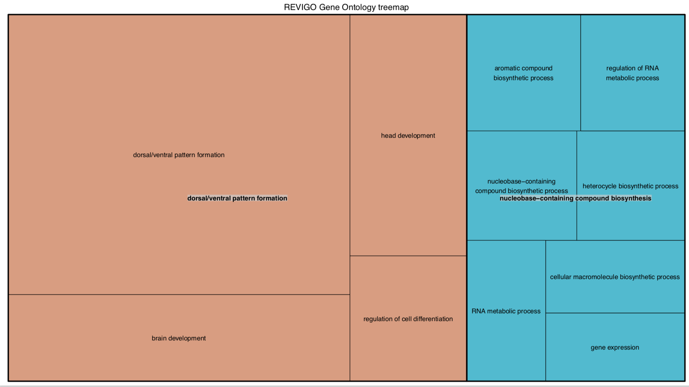

```{r, message = FALSE}
library(dplyr)
library(tidyr)
```


Using the protein IDs from the first module "Identifying Genes near DMRs" we will use DAVID to perform Gene Ontology based enrichment analysis. One of the benefits of DAVID is that it can perform GO annotation based on the several forms of IDs.  Annotating to the GO database yourself takes up a lot of space and time, so this is great.  The other benefit of DAVID that is so useful for non-model species is that it will accept a mixed-species gene list (and mixed-species background).


---


1.	Browser to DAVID: https://david.ncifcrf.gov/     
2.	Select ‘Start Analysis’ from Toolbar .   
a.	Step 1: ‘Enter Gene List: Paste your gene list (DMR_spid.txt) into the space provided .    
b.	Step2: ‘Select Identifier’: Select ‘UNIPROT_ID’ from the pull-down .    
c.	Step 3: ‘List Type’: Select ‘Gene List’ .    
d.	Click ‘Submit List’ .   
e.	Select ‘OK’ after reading the note: “Please note that multiple species have been detected in your gene list […] As a default, all species in your list will be used for analysis.    


## Next you will need to set the background using `Omykiss_background.txt` created in the prior module.


## There is lots of fun stuff you can do now! We will focus what Biological Processess (Gene Ontology) are enriched. 


## You should copy your URL as it will be different and not persistant so you can download. Replace your URL below to read in R. We will then write out. 

```{r}

BP_GOFAT <- read.csv("https://david.ncifcrf.gov/data/download/chart_6833676439DC1535059666910.txt", sep = '\t')


write.table(BP_GOFAT, "../data/BP_GOFAT.tab", sep = "\t", quote = F, row.names = F, col.names = T)

```


```{r}
GOterm_fold <- BP_GOFAT %>%
separate(Term, into = c("GOterm", "description"), sep = "~")  %>%
select(GOterm, Fold.Enrichment)


write.table(GOterm_fold, "../analyses/GOterm_fold", sep = "\t", quote = F, row.names = F, col.names = T)

```


## With the GO terms and fold enrichment values you can create several visualizations with Revigo


## And download R scripts to customize!


```{r}

# A treemap R script produced by the REVIGO server at http://revigo.irb.hr/
# If you found REVIGO useful in your work, please cite the following reference:
# Supek F et al. "REVIGO summarizes and visualizes long lists of Gene Ontology
# terms" PLoS ONE 2011. doi:10.1371/journal.pone.0021800

# author: Anton Kratz <anton.kratz@gmail.com>, RIKEN Omics Science Center, Functional Genomics Technology Team, Japan
# created: Fri, Nov 02, 2012  7:25:52 PM
# last change: Fri, Nov 09, 2012  3:20:01 PM

# -----------------------------------------------------------------------------
# If you don't have the treemap package installed, uncomment the following line:
#install.packages( "treemap" );
library(treemap) 								# treemap package by Martijn Tennekes

# Set the working directory if necessary
# setwd("C:/Users/username/workingdir");

# --------------------------------------------------------------------------
# Here is your data from REVIGO. Scroll down for plot configuration options.

revigo.names <- c("term_ID","description","freqInDbPercent","value","uniqueness","dispensability","representative");
revigo.data <- rbind(c("GO:0009953","dorsal/ventral pattern formation",0.034,21.7002,0.734,0.000,"dorsal/ventral pattern formation"),
c("GO:0060322","head development",0.151,6.3968,0.732,0.494,"dorsal/ventral pattern formation"),
c("GO:0045595","regulation of cell differentiation",0.345,3.3225,0.487,0.578,"dorsal/ventral pattern formation"),
c("GO:0007420","brain development",0.142,6.7201,0.708,0.563,"dorsal/ventral pattern formation"),
c("GO:0034654","nucleobase-containing compound biosynthetic process",14.533,2.7303,0.335,0.000,"nucleobase-containing compound biosynthesis"),
c("GO:0010467","gene expression",19.671,2.1536,0.617,0.126,"nucleobase-containing compound biosynthesis"),
c("GO:0019438","aromatic compound biosynthetic process",16.954,3.0059,0.459,0.462,"nucleobase-containing compound biosynthesis"),
c("GO:0018130","heterocycle biosynthetic process",17.388,2.6857,0.458,0.477,"nucleobase-containing compound biosynthesis"),
c("GO:0016070","RNA metabolic process",15.951,2.5210,0.357,0.518,"nucleobase-containing compound biosynthesis"),
c("GO:0051252","regulation of RNA metabolic process",10.029,2.7507,0.180,0.585,"nucleobase-containing compound biosynthesis"),
c("GO:0034645","cellular macromolecule biosynthetic process",19.291,2.2989,0.335,0.495,"nucleobase-containing compound biosynthesis"));

stuff <- data.frame(revigo.data);
names(stuff) <- revigo.names;

stuff$value <- as.numeric( as.character(stuff$value) );
stuff$freqInDbPercent <- as.numeric( as.character(stuff$freqInDbPercent) );
stuff$uniqueness <- as.numeric( as.character(stuff$uniqueness) );
stuff$dispensability <- as.numeric( as.character(stuff$dispensability) );

# by default, outputs to a PDF file
pdf( file="../analyses/revigo_treemap.pdf", width=16, height=9 ) # width and height are in inches

# check the tmPlot command documentation for all possible parameters - there are a lot more
tmPlot(
	stuff,
	index = c("representative","description"),
	vSize = "value",
	type = "categorical",
	vColor = "representative",
	title = "REVIGO Gene Ontology treemap",
	inflate.labels = FALSE,      # set this to TRUE for space-filling group labels - good for posters
	lowerbound.cex.labels = 0,   # try to draw as many labels as possible (still, some small squares may not get a label)
	bg.labels = "#CCCCCCAA",     # define background color of group labels
												       # "#CCCCCC00" is fully transparent, "#CCCCCCAA" is semi-transparent grey, NA is opaque
	position.legend = "none"
)

dev.off()

```




